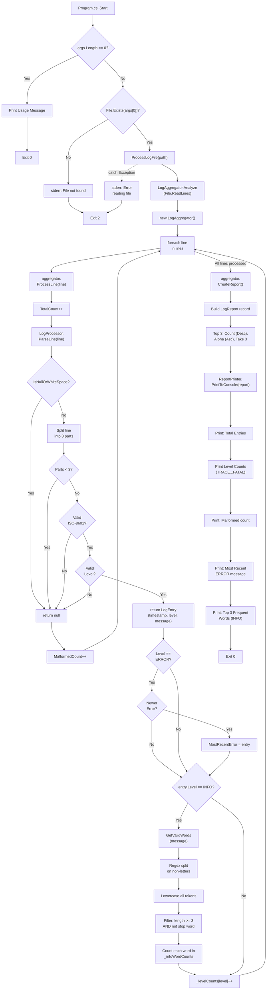

# Log Analyzer Program Flow

This diagram illustrates the logic flow of the [log-analyzer](log-analyzer/Program.cs) application, from command-line entry to report generation.

```mermaid
flowchart TD
    A["Program.cs: Start"] --> B{"args.Length == 0?"}
    B -- Yes --> C["Print Usage Message"] --> Z["Exit 0"]
    B -- No --> D{"File.Exists(args[0])?"}
    D -- No --> E["stderr: File not found"] --> Z2["Exit 2"]
    D -- Yes --> F["ProcessLogFile(path)"]
    
    F --> G["LogAggregator.Analyze<br/>(File.ReadLines)"]
    G --> H["new LogAggregator()"]
    H --> I["foreach line<br/>in lines"]
    
    I --> J["aggregator.<br/>ProcessLine(line)"]
    J --> K["TotalCount++"]
    K --> L["LogProcessor.<br/>ParseLine(line)"]
    
    L --> M{"IsNullOrWhiteSpace?"}
    M -- Yes --> N["return null"]
    M -- No --> O["Split line<br/>into 3 parts"]
    O --> P{"Parts < 3?"}
    P -- Yes --> N
    P -- No --> Q{"Valid<br/>ISO-8601?"}
    Q -- No --> N
    Q -- Yes --> R{"Valid<br/>Level?"}
    R -- No --> N
    R -- Yes --> S["return LogEntry<br/>(timestamp, level, message)"]
    
    N --> T["MalformedCount++"]
    T --> I
    
    S --> U{"Level ==<br/>ERROR?"}
    U -- Yes --> V{"Newer<br/>Error?"}
    V -- Yes --> W["MostRecentError = entry"]
    V -- No --> X{"entry.Level == INFO?"}
    U -- No --> X
    W --> X
    
    X -- Yes --> Y["GetValidWords<br/>(message)"]
    Y --> Y1["Regex split<br/>on non-letters"]
    Y1 --> Y2["Lowercase all tokens"]
    Y2 --> Y3["Filter: length >= 3<br/>AND not stop word"]
    Y3 --> Y4["Count each word in<br/>_infoWordCounts"]
    Y4 --> AA["_levelCounts[level]++"]
    X -- No --> AA
    
    AA --> I
    
    I -- "All lines processed" --> BB["aggregator.<br/>CreateReport()"]
    BB --> CC["Build LogReport record"]
    CC --> DD["Top 3: Count (Desc),<br/>Alpha (Asc), Take 3"]
    
    DD --> EE["ReportPrinter.<br/>PrintToConsole(report)"]
    EE --> FF["Print: Total Entries"]
    FF --> GG["Print Level Counts<br/>(TRACE...FATAL)"]
    GG --> HH["Print: Malformed count"]
    HH --> II["Print: Most Recent<br/>ERROR message"]
    II --> JJ["Print: Top 3 Frequent<br/>Words (INFO)"]
    JJ --> ZZ["Exit 0"]
    
    F -. "catch Exception" .-> EX["stderr: Error<br/>reading file"] --> Z2
```
